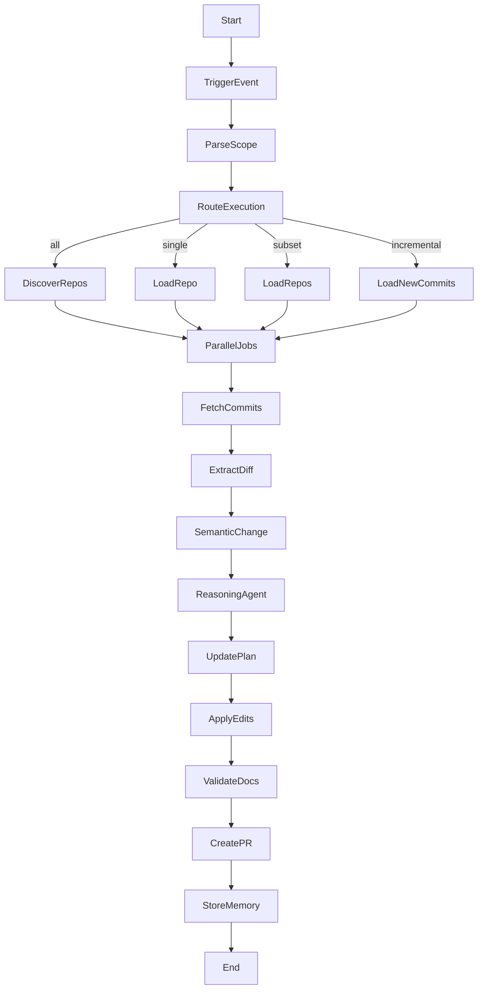

# Documentation Drift Watchdog Agent

## Overview

The Documentation Drift Watchdog Agent is an autonomous AI system that detects and fixes documentation drift in GitHub repositories. It monitors code changes, reasons about documentation impact, and creates precise Pull Requests to keep documentation up to date.

## Features
- Monitors all, single, or subset of repositories
- Parallel repo scanning
- Semantic code change detection (AST/diff)
- LLM-powered documentation impact reasoning
- Minimal, targeted documentation edits
- Automatic Pull Request creation with detailed drift reports
- Persistent memory to avoid duplicate work
- CLI, Web API, and scheduled triggers

## Usage

### 1. Install dependencies
```bash
pip install -r requirements.txt
```

### 2. Configure
Edit `config.yaml` with your GitHub token and settings.

### 3. Run (CLI)
```bash
python main.py --mode all
python main.py --mode single --repo my-repo
python main.py --mode subset --repos repo1 repo2
```

### 4. Run (Web API)
```bash
python main.py --webapi
# POST to /trigger with JSON payload
```

## Architecture

- **main.py**: Entry point, parses triggers
- **core/**: Trigger, doc editing, PR creation
- **github_tools/**: GitHub API, diff extraction
- **agents/**: LLM reasoning agent
- **workflow/**: LangGraph workflow DAG
- **memory/**: Persistent memory
- **webapi/**: FastAPI server

## LangGraph Workflow



## PR Report Example

```
## Documentation Drift Report

### Code Changes
- Added endpoint POST /users

### Documentation Updated
- README API section
- OpenAPI schema

### Reasoning
Endpoint added, docs missing entry.

### Safety Checks
OpenAPI validated.

### Drift Confidence Score
0.95
```

## License
MIT
